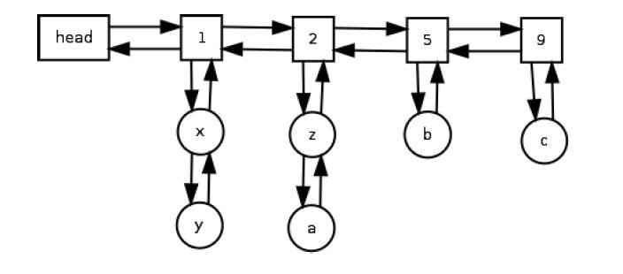

# LFU Concurrent Cache
An LFU cache implementation using concurrent linked lists hash maps and synchronized blocks to 
ensure thread safety. The implementation looks like the following image.

The cache has max capacity, and when this capacity is reached the element least frequently
used is evicted.  This is achieved with the above list of queues. Each queue, holds a 
frequency value, and the cache elements associated to that value in the order of insertion. 

When we need to evict, we only look at the queue with the smallest frequency value 
and evict the front of the queue. Similarly, new elements are added in the queue 
with frequency one at the end of the queue. 

When an element is accessed the frequency is updated ,and it's promoted to the 
corresponding queue. If the element has been idle for 5 seconds is also evicted.

This is the class containing the implementation: 
[LoadingCacheService](src/com/module2/task/LoadingCacheService.java)

# LRU Concurrent Cache - Guava
This cache holds all the same characteristics as the previous one, but it was made using
the Guava library, and the implementation is much more simple.

You cna find the implementation in this file: [CacheWrapper](src/com/module2/guavaTask/CacheWrapper.java)
